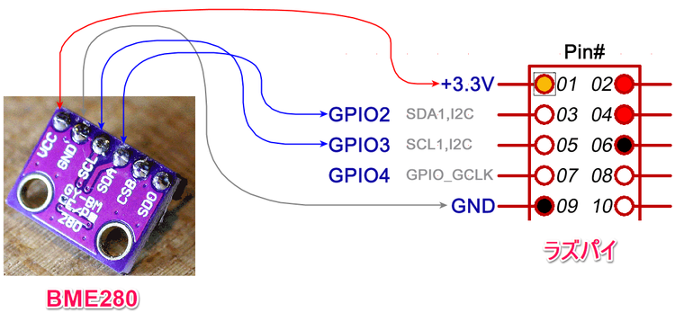

# BME280温湿度气压传感器接线图

## 接线图
VCC (BME280)  -> 3.3v P01 (Raspberry Pi)   
GND (BME280)  -> GND  P06 (Raspberry Pi)   
SCL (BME280)  -> SCL P05 (Raspberry Pi)    
SDA (BME280)  -> SDA P03 (Raspberry Pi)  
CSB (BME280)  -> NC  
SDO (BME280)  -> NC  

