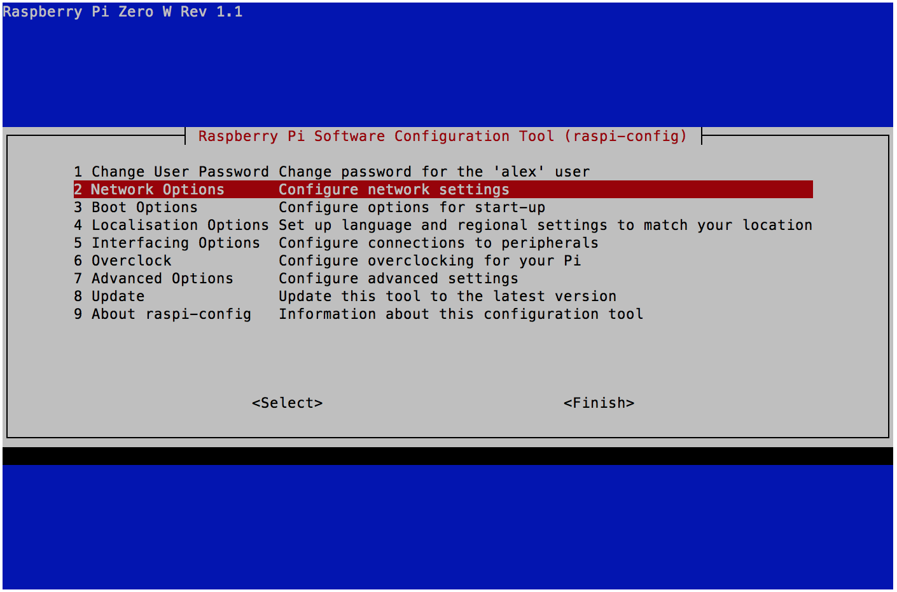
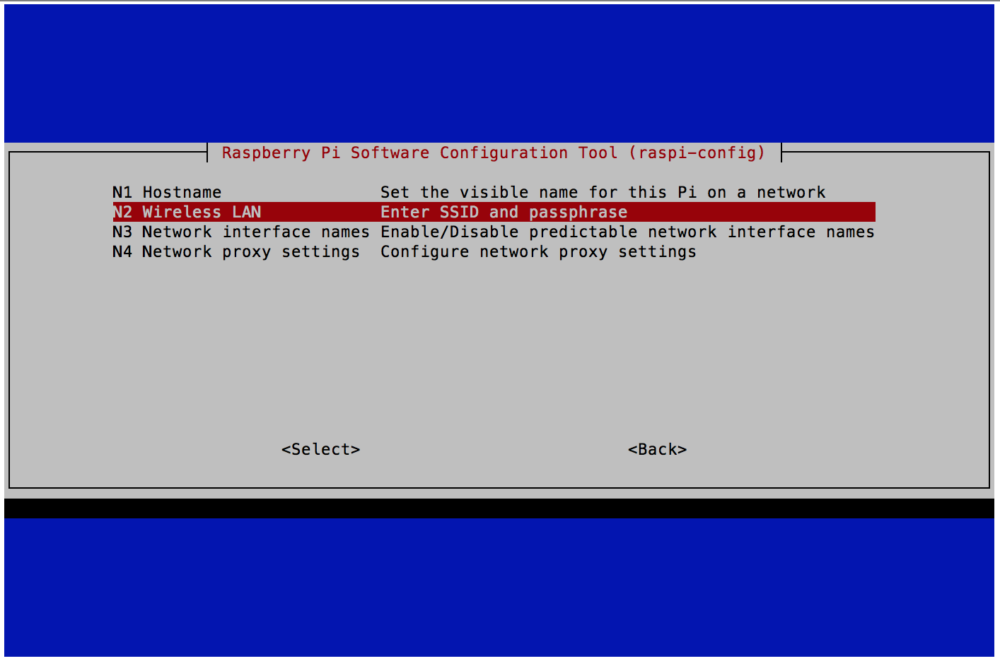
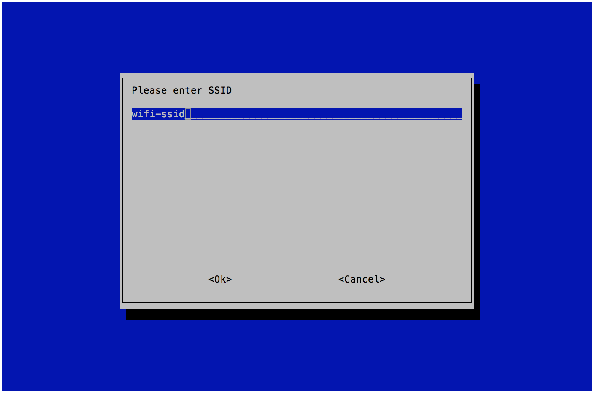
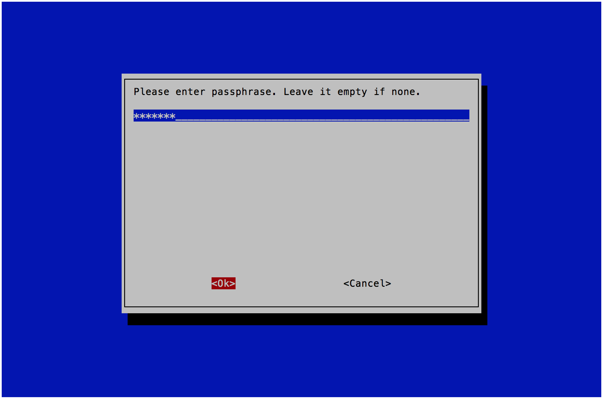

# 如何设置无线网络
设置树莓派的无线网络（Wi-Fi）的方法有多种:  

## 方法一，烧好SD卡后立刻设置
_这个方法多用于没有图形界面的树莓派ZERO_
1. 烧好SD卡后，把SD卡重新插入PC。  
  这时可以看到一个名为"boot"的U盘驱动器
1. 在boot的根目录下面创建一个名为"ssh"的空文件，没有文件后缀。
1. 再在boot的根目录下创建一个名为"wpa_supplicant.conf"的文件，内容如下：  
<pre><code>
country=CN  
ctrl_interface=DIR=/var/run/wpa_supplicant GROUP=netdev
update_config=1  
network={  
        ssid="SSID"  
        psk="WIFI密码"  
}
</code></pre>
  注意：树莓派ZERO只能连2.4G的Wi-Fi，树莓派4可以连5G和2.4G两种

1. 弹出SD卡  
1. 把SD卡插入树莓派并启动，即可连上Wi-Fi
1. 用 **ip a** 命令可确认网络连接状况
    <pre><code>
    $ ip a
    1: lo: <LOOPBACK,UP,LOWER_UP> mtu 65536 qdisc noqueue   state UNKNOWN group default qlen 1000  
    link/loopback 00:00:00:00:00:00 brd 00:00:00:00:00:00
    inet 127.0.0.1/8 scope host lo  
       valid_lft forever preferred_lft forever
    inet6 ::1/128 scope host
       valid_lft forever preferred_lft forever
    2: wlan0: <BROADCAST,MULTICAST,UP,LOWER_UP> mtu 1500 qdisc pfifo_fast state UP group default qlen 1000
    link/ether b8:27:eb:af:d0:47 brd ff:ff:ff:ff:ff:ff
    inet 192.168.11.52/24 brd 192.168.11.255 scope global dynamic noprefixroute wlan0
       valid_lft 172278sec preferred_lft 150678sec
    inet6 fe80::702:b0bc:ecaf:9876/64 scope link
       valid_lft forever preferred_lft forever
    </code></pre>

## 方法二，在树莓派启动后使用raspi-config字符界面
_这个方法也多用于没有图形界面的情况，如树莓派ZERO_

1. 在控制台输入 **sudo raspi-config**
1. 用键盘的上下键，如图选择，并用回车键选定  
      
    
1. 输入Wi-Fi名称， 然后用[TAB]键把光标移到<OK>，回车  
    
1. 输入Wi-Fi密码，然后用[TAB]键把光标移到<OK>，回车
    
1. 用[ESC]键退到主菜单，然后然后用[TAB]键把光标移到<Finish>，回车
1. 用 **ip a** 命令可确认网络连接状况
