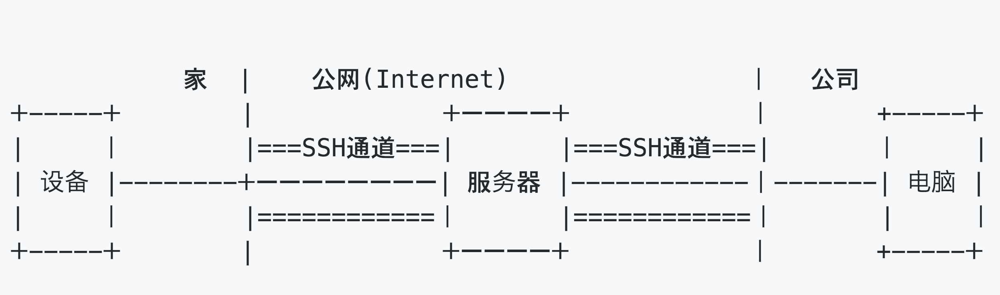
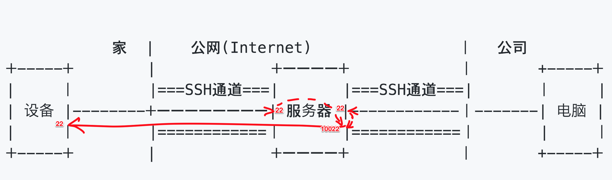

# 建立安全连接
## 背景

我们通过SSH(Secure Shell)建立互联网上的两台设备之间的安全连接，避免被隐私数据被监听偷窃。
但是，如果两台设备都在内网，没法对外公开SSH端口时该怎么办呢。

## 解决方案
我们可以通过一台公网的服务器作为跳板，连接这两台设备。  
_关于免费公网服务器可参考： [如何获得免费(3个月)公网服务器](https://cloud.google.com/free?hl=zh-cn)_

## 系统的构成例
_我以这个构成为例进行说明_

## 步骤
_以下的**$**符号代表使用一般用户权限运行，**$**本身不需要输入_
1. 分别在电脑和设备上生成SSH密钥  
    <pre><code>
    $ ssh-keygen
      Generating public/private rsa key pair.
      Enter file in which to save the key (/home/yourid/.ssh/id_rsa):
      Enter passphrase (empty for no passphrase):
      Enter same passphrase again:
      Your identification has been saved in /home/yourid/.ssh/id_rsa.
      Your public key has been saved in /home/yourid/.ssh/id_rsa.pub.
      The key fingerprint is:
      SHA256:ZPlADYms58C/isWxr4wE01QLEnUZ9/BvqboneBFi9xg yourid@yourdev
      The key's randomart image is:
      +---[RSA 2048]----+
      |ooo ++o.o+       |
      | . +.oo=...      |
      |  ....  B        |
      | o  * Eo + .     |
      |o ...B =S =      |
      | o . o= .o       |
      |  . +. o.        |
      | . =..+..        |
      |  o ++++         |
      +----[SHA256]-----+
    </code></pre>
1. 把电脑及设备的公钥都注册到服务器
    _因为即使是SSH加密通道，建立SSH连接密码认证时传输的用户名和密码时明码，很容易被监听，所以强力建议使用密钥认证_
    把下面ssh-rsa AAA...的所有内容添加到公网服务器的~/home/yourid/.ssh/authorized_keys
    > $ cat ~/.ssh/id_rsa.pub  
    >ssh-rsa AAAAB3NzaC1yc2...BOKlAbilPeVB66Gh yourid@yourdev  

1. 把电脑侧的公钥也注册到设备上，方法同上

1. 建立设备到SSH通道  
    把本地的SSH端口(22)传送到服务器的10022端口（可以是任意没有占有的端口，10022是为了好记）
    >$ ssh yourid@服务器IP -NR 10022:localhost:22  

    _N 表示不执行任何服务器端的命令_  
    _R 用来指定远端(Remote)，即服务器端的端口_
1. 从电脑侧发起访问
    > $ ssh -J yourid@服务器IP -p 10022 设备上的yourid@localhost

    
